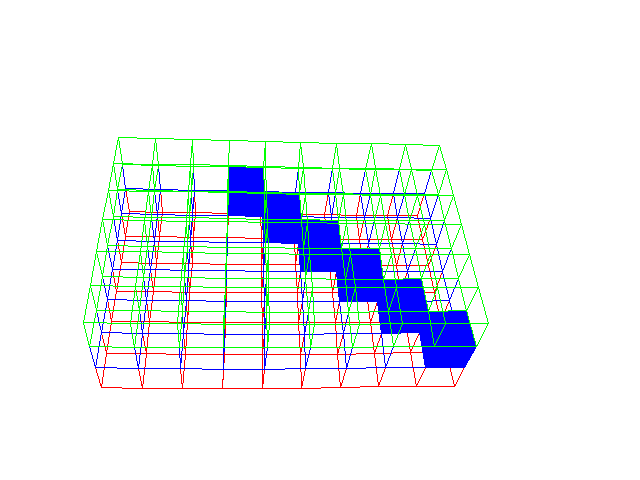

# Hướng tiếp cận tạm thời

Sử dụng bài toán Multi label classification cho bài toán ước lượng thể tích vật bỏ vào hộp

input: 2 ảnh chứa 2 góc view cố định vào hộp
output: xác suất chứa vật của tất cả các ô trong hộp

>note: mỗi ô trong hộp được coi là 1 label. số label của hộp là `h*w*c`

Quá trình tạo data: lần lượt fill đầy các ô trong box ảo đã tạo sau đó đánh dấu các ô được fill là 1 để tạo label cho ảnh đó

Một ví dụ sau khi fill  1 vài ô trong lưới ảo
